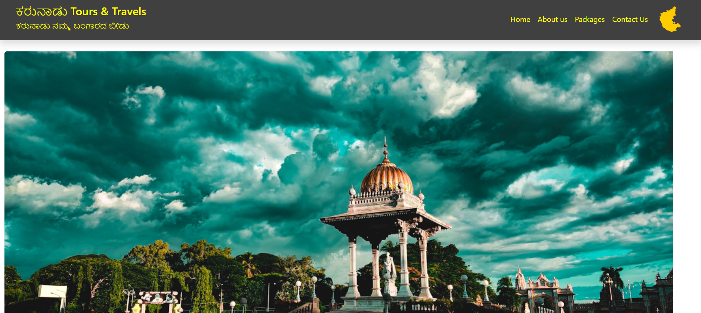
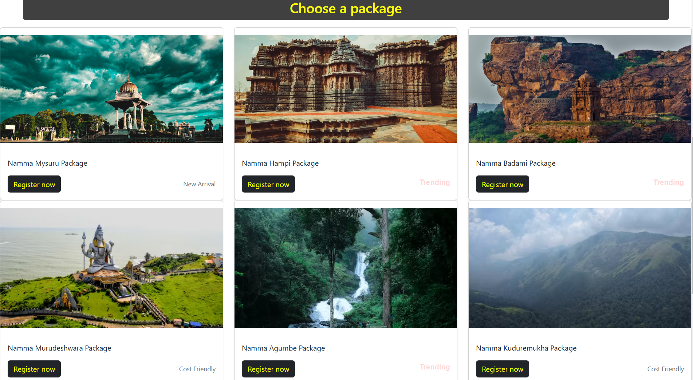
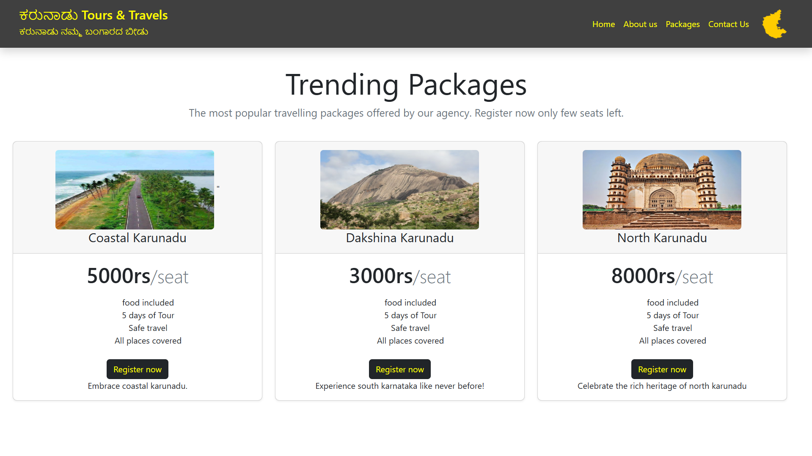
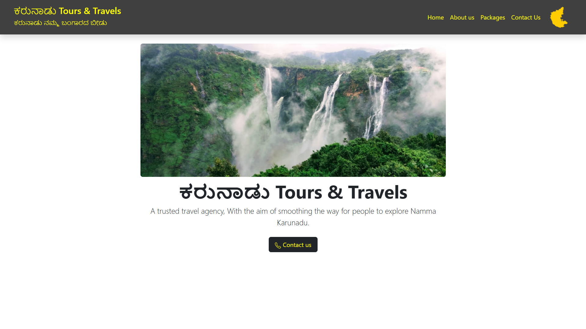
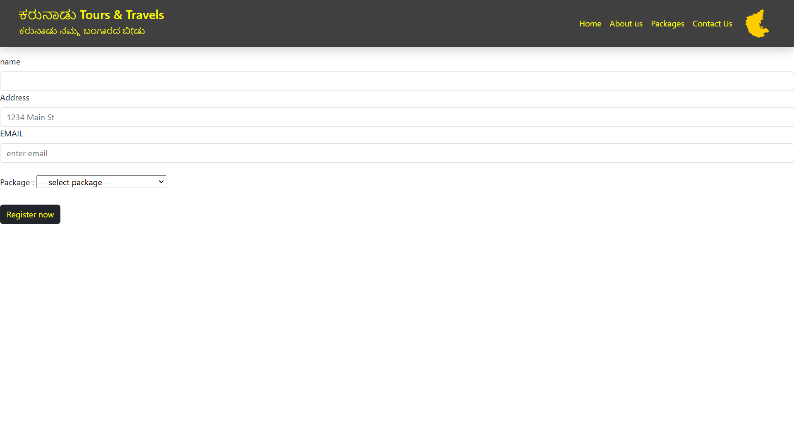
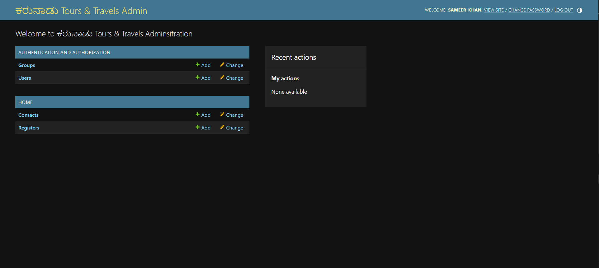

# Karunadu Travel Agency Management System

**Karunadu** is a sleek and user-friendly Django-based Travel Agency Management System, designed to provide a seamless experience for customers to browse, book, and manage travel packages, and for admins to manage bookings and customers. The system features a premium black and gold-themed interface, creating a sophisticated atmosphere for users.

## Features
- **Travel Package Management**: Admins can add, update, and delete travel packages.
- **Customer Booking**: Customers can view available travel packages and make bookings.
- **Admin Panel**: Admins can manage customers, bookings, and packages easily using Django's built-in admin panel.
- **Ratings and Reviews**: Customers can leave ratings and reviews for the packages they book.
- **Sleek Interface**: Designed with a black and gold theme for a premium user experience.

## Screenshots
### Homepage


### Packages


### Trending Packages


### About Us


### Register


### Admin Dashboard


## Technologies used

- Django
- Python
- SQLite (or PostgreSQL if needed)
- HTML/CSS (for front-end design)
- JavaScript (optional for extra interactivity)

## How to Run
To set up and run the application locally, follow these steps:

```bash
1. Clone the repository:
   git clone https://github.com/sameer-khan-a/Karunadu_Travels_using_Django.git

2. Navigate to the project directory:
   cd Karunadu_Travels_using_Django

3. Install the required dependencies:
   pip install -r requirements.txt

4. Set up the database:
   python manage.py migrate

5. Create a superuser for admin access:
   python manage.py createsuperuser

6. Start the Django development server:
   python manage.py runserver

7. Access the website by visiting:
   http://127.0.0.1:8000/


